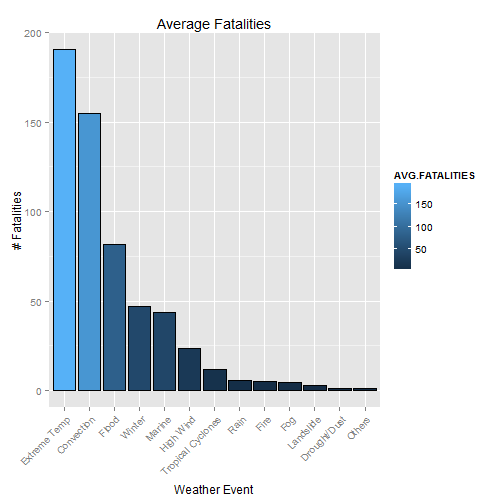
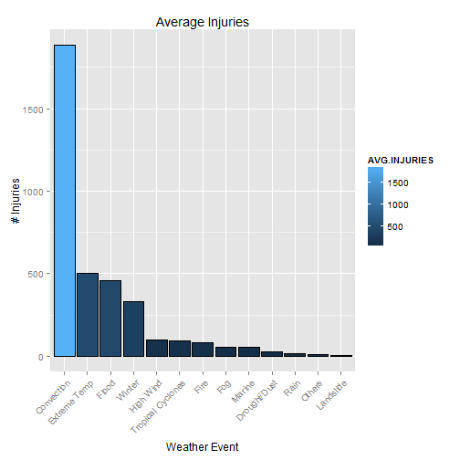
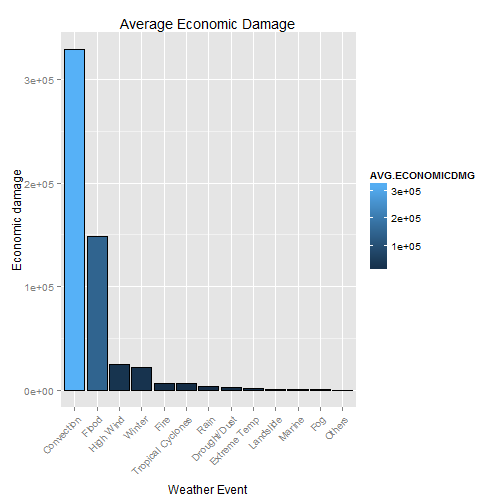

# STORM ANALYSIS
# By Shirlene Paul

## Synopsis 

In this report we aim to answer some basic questions about severe weather
events.  Specifically, we try to identify which types of events are the most
harmful to population health and the most deleterious to the economy.
To answer these questions, we obtained the storm database from the
U.S. National Oceanic and Atmospheric Administration's (NOAA).  This database
tracks characteristics of major storms and weather events in the United States,
including estimates of any fatalities, injuries, and property and crop damage.
From these data, we found that tornadoes and heat are the severe weather
event types by far most dangerous to people, while flooding, hurricanes, and storm
surges are the most costly event types to the economy.  Interestingly, only
flooding is one of the top three most dangerous or most costly event types.


**About the Data**

The weather events are divided into 13 groups:

-Convection (e.g. tornado, lightning, thunderstorm, hail)
-Flood (e.g. flash flood, river flood)
-Extreme temperatures (e.g. extreme cold, extreme hot)
-Marine (e.g. tsunami, coastal storm, rip current, high waves, high seas)
-Winter (e.g. avalanche, snow, blizzard, icy roads, freeze)
-Tropical Cyclones (e.g. tropical storm, hurricane)
-High Wind (e.g. winds, microburst)
-Fire
-Rain
-Drought/Dust (e.g. drought, dust storm, dust)
-Landslide
-Fog
-Others


## Data Processing


```r
#Setting WD
setwd("C:/Users/antona6/Desktop/reproducible research/Peer_Assessment2")

#Unzip and read .csv file into the variable data
unzip <- bzfile("repdata-data-StormData.csv.bz2", "r")
data <- read.csv(unzip, stringsAsFactors = FALSE)
```

```
## Warning: closing unused connection 5 (repdata-data-StormData.csv.bz2)
```

```r
close(unzip)
```

**Select useful data** 

Subsetting data into variables that are needed and adding a new variable.


```r
x <- which(colnames(data) %in% c("BGN_DATE", "PROPDMG", "CROPDMG", "EVTYPE", 
    "INJURIES", "FATALITIES"))
data <- data[, x]
head(data)
```

```
##             BGN_DATE  EVTYPE FATALITIES INJURIES PROPDMG CROPDMG
## 1  4/18/1950 0:00:00 TORNADO          0       15    25.0       0
## 2  4/18/1950 0:00:00 TORNADO          0        0     2.5       0
## 3  2/20/1951 0:00:00 TORNADO          0        2    25.0       0
## 4   6/8/1951 0:00:00 TORNADO          0        2     2.5       0
## 5 11/15/1951 0:00:00 TORNADO          0        2     2.5       0
## 6 11/15/1951 0:00:00 TORNADO          0        6     2.5       0
```

```r
#Formatting date and time
data$YEAR <- as.integer(format(as.Date(data$BGN_DATE, "%m/%d/%Y 0:00:00"), "%Y"))
head(data)
```

```
##             BGN_DATE  EVTYPE FATALITIES INJURIES PROPDMG CROPDMG YEAR
## 1  4/18/1950 0:00:00 TORNADO          0       15    25.0       0 1950
## 2  4/18/1950 0:00:00 TORNADO          0        0     2.5       0 1950
## 3  2/20/1951 0:00:00 TORNADO          0        2    25.0       0 1951
## 4   6/8/1951 0:00:00 TORNADO          0        2     2.5       0 1951
## 5 11/15/1951 0:00:00 TORNADO          0        2     2.5       0 1951
## 6 11/15/1951 0:00:00 TORNADO          0        6     2.5       0 1951
```

```r
#To uppercase
data$EVTYPE <- toupper(data$EVTYPE)
head(data)
```

```
##             BGN_DATE  EVTYPE FATALITIES INJURIES PROPDMG CROPDMG YEAR
## 1  4/18/1950 0:00:00 TORNADO          0       15    25.0       0 1950
## 2  4/18/1950 0:00:00 TORNADO          0        0     2.5       0 1950
## 3  2/20/1951 0:00:00 TORNADO          0        2    25.0       0 1951
## 4   6/8/1951 0:00:00 TORNADO          0        2     2.5       0 1951
## 5 11/15/1951 0:00:00 TORNADO          0        2     2.5       0 1951
## 6 11/15/1951 0:00:00 TORNADO          0        6     2.5       0 1951
```

```r
# creates new variable
data$ECONOMICDMG <- data$PROPDMG + data$CROPDMG
head(data)
```

```
##             BGN_DATE  EVTYPE FATALITIES INJURIES PROPDMG CROPDMG YEAR
## 1  4/18/1950 0:00:00 TORNADO          0       15    25.0       0 1950
## 2  4/18/1950 0:00:00 TORNADO          0        0     2.5       0 1950
## 3  2/20/1951 0:00:00 TORNADO          0        2    25.0       0 1951
## 4   6/8/1951 0:00:00 TORNADO          0        2     2.5       0 1951
## 5 11/15/1951 0:00:00 TORNADO          0        2     2.5       0 1951
## 6 11/15/1951 0:00:00 TORNADO          0        6     2.5       0 1951
##   ECONOMICDMG
## 1        25.0
## 2         2.5
## 3        25.0
## 4         2.5
## 5         2.5
## 6         2.5
```

```r
# Select only positive value data
data <- subset(data, data$FATALITIES > 0 | data$ECONOMICDMG > 0 | data$INJURIES > 
    0)
head(data)
```

```
##             BGN_DATE  EVTYPE FATALITIES INJURIES PROPDMG CROPDMG YEAR
## 1  4/18/1950 0:00:00 TORNADO          0       15    25.0       0 1950
## 2  4/18/1950 0:00:00 TORNADO          0        0     2.5       0 1950
## 3  2/20/1951 0:00:00 TORNADO          0        2    25.0       0 1951
## 4   6/8/1951 0:00:00 TORNADO          0        2     2.5       0 1951
## 5 11/15/1951 0:00:00 TORNADO          0        2     2.5       0 1951
## 6 11/15/1951 0:00:00 TORNADO          0        6     2.5       0 1951
##   ECONOMICDMG
## 1        25.0
## 2         2.5
## 3        25.0
## 4         2.5
## 5         2.5
## 6         2.5
```

Data aggregation


```r
library(plyr)
```

```
## -------------------------------------------------------------------------
## You have loaded plyr after dplyr - this is likely to cause problems.
## If you need functions from both plyr and dplyr, please load plyr first, then dplyr:
## library(plyr); library(dplyr)
## -------------------------------------------------------------------------
## 
## Attaching package: 'plyr'
## 
## The following objects are masked from 'package:dplyr':
## 
##     arrange, count, desc, failwith, id, mutate, rename, summarise,
##     summarize
```

```r
# data aggregated by YEAR & EVTYPE.
#ddply -> For each subset of a data frame, apply function then combine results into a data frame.

eventYear <- ddply(data[, -1], .(YEAR, EVTYPE),
                   .fun = function(x) {
                         return(
                           c(sum(x$FATALITIES), sum(x$ECONOMICDMG), sum(x$INJURIES))
                              )
                                      }
                   )
names(eventYear) <- c("YEAR", "EVTYPE", "FATALITIES", "ECONOMICDMG", "INJURIES")
head(eventYear)
```

```
##   YEAR  EVTYPE FATALITIES ECONOMICDMG INJURIES
## 1 1950 TORNADO         70    16999.15      659
## 2 1951 TORNADO         34    10560.99      524
## 3 1952 TORNADO        230    16679.74     1915
## 4 1953 TORNADO        519    19182.20     5131
## 5 1954 TORNADO         36    23367.82      715
## 6 1955 TORNADO        129    27715.63      926
```

**Grouping the events**
We grouped the events by its related categories


```r
#Function that calculates the events by categories (13 categories described in the synopsis)

#grepl -> search for matches to argument pattern within each element of a character vector

eventCategory <- function(x) {
    ev <- x$EVTYPE[1]
    if (grepl("LIG(H|N)T(N|)ING|TORNADO|T(H|)U(N|)(DER|ER|DEER|DERE)(STORM|STROM|TORM)|TSTM|HAIL", 
        ev)) {
        category <- "Convection"
    } else if (grepl("WINT(ER|RY)|ICE|AVALANC(H|)E|SNOW|BLIZZARD|FREEZ|ICY|FROST", 
        ev)) {
        category <- "Winter"
    } else if (grepl("COLD|HEAT|HOT|TEMPERATURE|COOL|WARM", ev)) {
        category <- "Extreme Temp"
    } else if (grepl("FLOOD| FLD$", ev)) {
        category <- "Flood"
    } else if (grepl("COASTAL|TSUNAMI|RIP CURRENT|MARINE|WATERSPOUT|SURF|SLEET|SEAS|(HIGH|RISING|HEAVY) (WAVES|SWELLS|WATER)", 
        ev)) {
        category <- "Marine"
    } else if (grepl("TROPICAL|HURRICANE|STORM SURGE|TYPHOON", ev)) {
        category <- "Tropical Cyclones"
    } else if (grepl("WIND|MICROBURST", ev)) {
        category <- "High Wind"
    } else if (grepl("FIRE", ev)) {
        category <- "Fire"
    } else if (grepl("RAIN|PRECIP", ev)) {
        category <- "Rain"
    } else if (grepl("DROUGHT|DUST", ev)) {
        category <- "Drought/Dust"
    } else if (grepl("LANDSLIDE|MUD.*SLIDE", ev)) {
        category <- "Landslide"
    } else if (grepl("FOG|VOG", ev)) {
        category <- "Fog"
    } else {
        category <- "Others"
    }

    x$EVGROUP <- rep(category, dim(x)[1])
    return(x)
}
eventYear <- ddply(eventYear, .(EVTYPE), .fun = eventCategory)
head(eventYear)
```

```
##   YEAR                EVTYPE FATALITIES ECONOMICDMG INJURIES    EVGROUP
## 1 2001    HIGH SURF ADVISORY          0         200        0     Marine
## 2 2000           FLASH FLOOD          0          50        0      Flood
## 3 1999             TSTM WIND          0         100        0 Convection
## 4 2000             TSTM WIND          0           8        0 Convection
## 5 1998       TSTM WIND (G45)          0           8        0 Convection
## 6 1994                     ?          0           5        0     Others
```

```r
#We organize the data to show FATALITIES, ECONOMICDMG and INJURIES
#by YEAR and EVGROUP

groupYear <- ddply(eventYear, .(YEAR, EVGROUP), .fun = function(x) {
    return(c(sum(x$FATALITIES), sum(x$ECONOMICDMG), sum(x$INJURIES)))
})

names(groupYear) <- c("YEAR", "EVGROUP", "FATALITIES", "ECONOMICDMG", "INJURIES")
head(groupYear)
```

```
##   YEAR    EVGROUP FATALITIES ECONOMICDMG INJURIES
## 1 1950 Convection         70    16999.15      659
## 2 1951 Convection         34    10560.99      524
## 3 1952 Convection        230    16679.74     1915
## 4 1953 Convection        519    19182.20     5131
## 5 1954 Convection         36    23367.82      715
## 6 1955 Convection        129    27715.63      926
```

```r
# calculate average annual damage by group
eventFirstYear <- ddply(groupYear, .(EVGROUP), .fun = function(x) {
    return(c(min(x$YEAR)))
})
names(eventFirstYear) <- c("Weather.Event", "First.Year")
head(eventFirstYear)
```

```
##   Weather.Event First.Year
## 1    Convection       1950
## 2  Drought/Dust       1993
## 3  Extreme Temp       1993
## 4          Fire       1993
## 5         Flood       1993
## 6           Fog       1993
```

As we can notice analysing the variable eventFirstYear, the weather event "Convection" has its occurency starting at the 50's but the others events starts at 1993. In this section we subset the groupYear to analysis all the events starting from 1993


```r
## start data analysis at 1993
groupYear <- subset(groupYear, YEAR >= 1993)

# calculate average annual damage by group
byGroup <- ddply(groupYear, .(EVGROUP), .fun = function(x) {
    return(c(mean(x$FATALITIES), mean(x$ECONOMICDMG), mean(x$INJURIES)))
})
names(byGroup) <- c("EVGROUP", "AVG.FATALITIES", "AVG.ECONOMICDMG", "AVG.INJURIES")
head(byGroup)
```

```
##        EVGROUP AVG.FATALITIES AVG.ECONOMICDMG AVG.INJURIES
## 1   Convection     154.894737     328814.5858   1883.68421
## 2 Drought/Dust       1.263158       2388.8053     25.63158
## 3 Extreme Temp     190.578947       1461.9379    503.31579
## 4         Fire       4.736842       7093.8963     84.63158
## 5        Flood      81.736842     148846.0779    456.89474
## 6          Fog       4.210526        898.6979     56.63158
```

## Results

**Results section 1 - Health Harmful Events**

This histograms Show fatalities and injuries for weather events.


```r
# Graph libraries
library(ggplot2)
library(scales)

# average annual populational damage by group of event
byGroup$EVGROUP <- with(byGroup, reorder(EVGROUP, -AVG.FATALITIES))
g <- ggplot(byGroup, aes(x = EVGROUP))
g + geom_histogram(aes(weight = AVG.FATALITIES, fill = AVG.FATALITIES), binwidth = 5, 
    color = "black") + ggtitle("Average Fatalities") + ylab("# Fatalities") + 
    xlab("Weather Event") + theme(axis.text.x = element_text(angle = 45, hjust = 1))
```

 

```r
# average annual populational damage by group of event
byGroup$EVGROUP <- with(byGroup, reorder(EVGROUP, -AVG.INJURIES))
g <- ggplot(byGroup, aes(x = EVGROUP))
g + geom_histogram(aes(weight = AVG.INJURIES, fill = AVG.INJURIES), binwidth = 1, 
    color = "black") + ggtitle("Average Injuries") + ylab("# Injuries") + xlab("Weather Event") + 
    theme(axis.text.x = element_text(angle = 45, hjust = 1))
```

 


**Results section 2 - Economic Harm**
  
Histogram of weather event harm to the economy.


```r
# average annual economical damage by group of event
byGroup$EVGROUP <- with(byGroup, reorder(EVGROUP, -AVG.ECONOMICDMG))
g <- ggplot(byGroup, aes(x = EVGROUP))
g + geom_histogram(aes(weight = AVG.ECONOMICDMG, fill = AVG.ECONOMICDMG), binwidth = 1, 
    color = "black") + ggtitle("Average Economic Damage") + ylab("Economic damage") + 
    xlab("Weather Event") + theme(axis.text.x = element_text(angle = 45, hjust = 1))
```

 

## Conclusion 

So based on the analysis performed above, we can notice that,the most harmful events for population are "Extreme temperatures" and "Convection" when we look at "Average Fatalities". But, When we talk about "Average Injuries", we have the same events, but in a different order - "Convection" and "Extreme Temperatures".

Now, looking at Economic damage,the extremely harmful events for economy are
"Convection" and "Flood".

